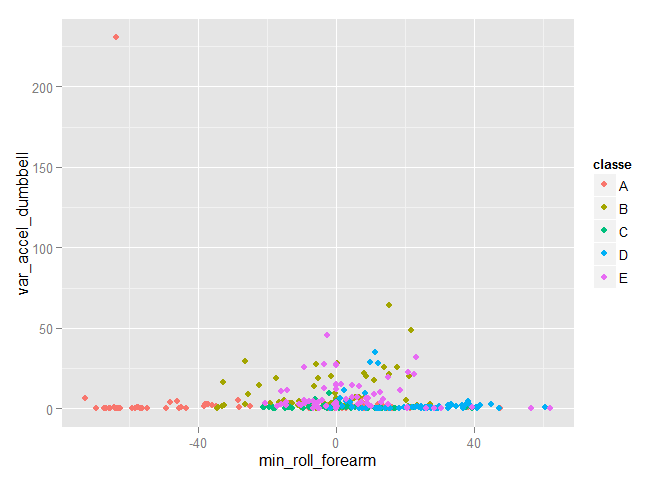

# Exercise Activity Analysis


### Synopsis  

In this report we analyze data from a group of 6 people who exercised and measured their activity using accelerometers on the belt, forearm, arm, and dumbell. A prediction model is built using this data to predict the manner in which the partcipants exercised.

### Data Processing

We downloaded and analyzed the training and test data sets. We used the 
repeated k-fold Cross Validation process with k=10 and number of repeats=3.
For preprocessing, we used "knnimpute" to impute missing values and standardize.
Then we applied classification tree, Naive Bayes  and Random Forest algorithms. 


```r
library(caret)
set.seed(32343)
training <- read.csv("pml-training.csv")
dim(training)
```

```
## [1] 19622   160
```

```r
testing <- read.csv("pml-testing.csv")
dim(testing)
```

```
## [1]  20 160
```

```r
summary(training$classe)
```

```
##    A    B    C    D    E 
## 5580 3797 3422 3216 3607
```

```r
#Remove unwanted variables
training1 <- subset(training, select = -c(X,user_name,raw_timestamp_part_1,raw_timestamp_part_2,cvtd_timestamp))
#Convert to numeric except first (new_window) and last (classe)
training1[, 2:154] <- sapply(training1[, 2:154], as.numeric)

train_control <- trainControl(method="repeatedcv", number=10, repeats=3)

# modelrpart <- train(classe~., data=training1, trControl=train_control, preProcess="knnImpute",method="rpart")
# modelnb <- train(classe~., data=training1, trControl=train_control, preProcess="knnImpute",method="nb")
modelrf <- train(classe~., data=training1, trControl=train_control, preProcess="knnImpute",method="rf")
      
training2 <- na.omit(training1) #will predict rows with no NAa

#confusionMatrix(predict(modelrpart, training2[,1:154]), training2$classe)
#confusionMatrix(predict(modelnb, training2[,1:154]), training2$classe)
confusionMatrix(predict(modelrf, training2[,1:154]), training2$classe)
```

```
## Confusion Matrix and Statistics
## 
##           Reference
## Prediction   A   B   C   D   E
##          A 109   0   0   0   0
##          B   0  79   0   0   0
##          C   0   0  70   0   0
##          D   0   0   0  69   0
##          E   0   0   0   0  79
## 
## Overall Statistics
##                                     
##                Accuracy : 1         
##                  95% CI : (0.991, 1)
##     No Information Rate : 0.268     
##     P-Value [Acc > NIR] : <2e-16    
##                                     
##                   Kappa : 1         
##  Mcnemar's Test P-Value : NA        
## 
## Statistics by Class:
## 
##                      Class: A Class: B Class: C Class: D Class: E
## Sensitivity             1.000    1.000    1.000     1.00    1.000
## Specificity             1.000    1.000    1.000     1.00    1.000
## Pos Pred Value          1.000    1.000    1.000     1.00    1.000
## Neg Pred Value          1.000    1.000    1.000     1.00    1.000
## Prevalence              0.268    0.195    0.172     0.17    0.195
## Detection Rate          0.268    0.195    0.172     0.17    0.195
## Detection Prevalence    0.268    0.195    0.172     0.17    0.195
## Balanced Accuracy       1.000    1.000    1.000     1.00    1.000
```


### Results

TO estimate out of sample error, we looked accuracy, sensitivity, specificity, positive predictive value and negative predictive value in the confusion matrix generated by different algorithms. Random Forest produced the best results.
See below for the most important variables. A plot has been created with the 
top two variables in importance and we see distinct groupings.


```r
varImp(modelrf)
```

```
## rf variable importance
## 
##   only 20 most important variables shown (out of 154)
## 
##                        Overall
## min_roll_forearm         100.0
## var_accel_dumbbell        95.7
## stddev_roll_belt          83.2
## var_roll_belt             69.9
## avg_roll_dumbbell         56.4
## magnet_dumbbell_z         40.0
## num_window                32.4
## avg_pitch_forearm         31.9
## var_total_accel_belt      31.9
## avg_roll_belt             30.9
## avg_roll_forearm          28.3
## accel_forearm_z           28.2
## magnet_dumbbell_y         26.8
## roll_dumbbell             21.4
## var_accel_arm             20.1
## roll_forearm              16.7
## avg_pitch_dumbbell        14.5
## amplitude_yaw_arm         14.4
## avg_yaw_dumbbell          11.9
## kurtosis_picth_forearm    11.8
```

```r
qplot(min_roll_forearm,var_accel_dumbbell,colour=classe,data=training2)
```

 
